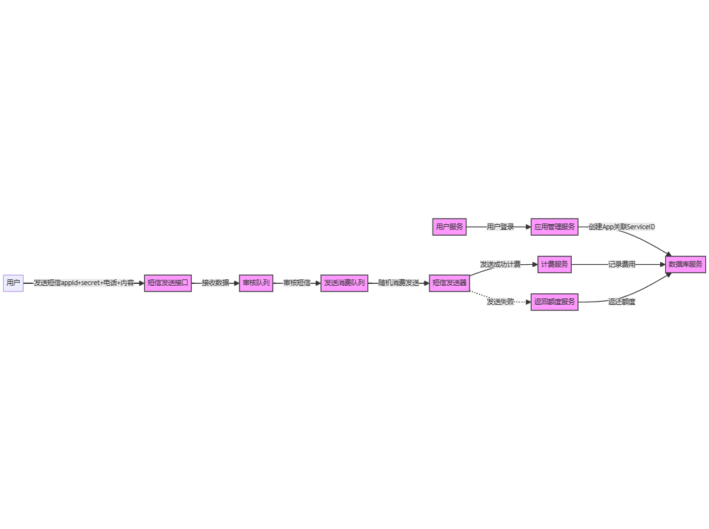

# TextCharge

## 微服务组件：
 - 用户服务：处理用户注册、登录、鉴权等功能。
 - 应用管理服务：让用户可以创建和管理应用，关联Service ID和用户账号。
 - 短信发送服务：接收AppId、Secret、电话号码和短信内容参数，处理短信发送流程。
 - 审核队列服务：存储等待审核的短信。
 - 审核服务：对队列中的短信进行内容审核。
 - 发送消费队列服务：存储经审核通过的短信，准备发送。
 - 计费服务：基于短信服务使用情况对用户进行计费。
 - 数据库服务：持久化用户数据、应用数据以及短信发送记录等。
## 微服务流程：
用户注册并登录，由用户服务处理。
 - 登录后，用户创建App并从应用管理服务获得AppId和Secret，并关联Service ID。
 - 用户发送短信请求，包含AppId、Secret、电话号码和短信内容，请求直接发送到短信发送服务。
 - 短信发送服务验证AppId和Secret的正确性，并将短信内容直接放入审核队列服务。
 - 审核服务从审核队列中取出短信，进行内容审核。
 - 审核通过的短信内容由审核服务转入发送消费队列服务。
 - 从发送消费队列服务中随机选择短信发送。
 - 在发送每条短信时，计费服务根据用户的使用量进行收费。

User Service（用户服务） - 处理用户注册、登录。
Application Management Service（应用管理服务） - 用户创建应用关联ServiceID，并关联到用户。
API Gateway（API网关） - 对所有微服务的统一进入点。负责请求路由和负载分配。
Authentication Service（认证服务） - 校验从客户端传入的appid和secret的合法性。
Validation Service（验证服务） - 验证输入的短信内容格式，以及对appid和secret的验证。
Messaging Queue Service（消息队列服务） - 存储待审核的短信。
Inspection Service（审核服务） - 从队列中提取并审核短信内容。
Dispatch Queue Service（发送队列服务） - 存入已过审核的短信，等待发送。
SMS Service（短信服务） - 从发送队列取出短信进行实际的短信发送。
Billing Service（计费服务） - 当服务使用完毕后进行计费操作。
Quota Service（配额服务） - 当短信发送失败时，需要返回用户的短信额度。

+------------------+     +-------------------+     +-------------------+     +------------------+
|   User Service  |     |   App Service    |     |   SMS Service    |     |  Approval Service |
+------------------+     +-------------------+     +-------------------+     +------------------+
         |                       |                           |                           |
         v                       v                           v                           v
   +------------------+     +-------------------+     +-------------------+     +------------------+
   |   Register User  |     |   Create App    |     |   Receive SMS   |     |   Approve SMS    |
   +------------------+     +-------------------+     +-------------------+     +------------------+
         |                       |                           |                           |
         v                       v                           v                           v
   +------------------+     +-------------------+     +-------------------+     +------------------+
   |   Login User    |     |   Associate App |     |   Verify App    |     |   Send SMS       |
   +------------------+     +-------------------+     +-------------------+     +------------------+
                                               
                                       |                           
                                       v                           
                                +------------------+                
                                |   Billing Service|                
                                +------------------+
                                       |
                                       v
                                +------------------+
                                |   Send Service   |
                                +------------------+
                                       |
                                       v
                                +------------------+
                                |   Send SMS       |
                                +------------------+

## 接口:

   - account/login
   - account/register
   
   - app/create
   - app/list
   - app/delete
   - app/info
   - app/edit

   - billing/log
   
   - sms/send

   - api/user
   - login
   - register
   - logout
   - reset-password
   - email/verification-notification
   - sanctum/csrf-cookie

## Flow
